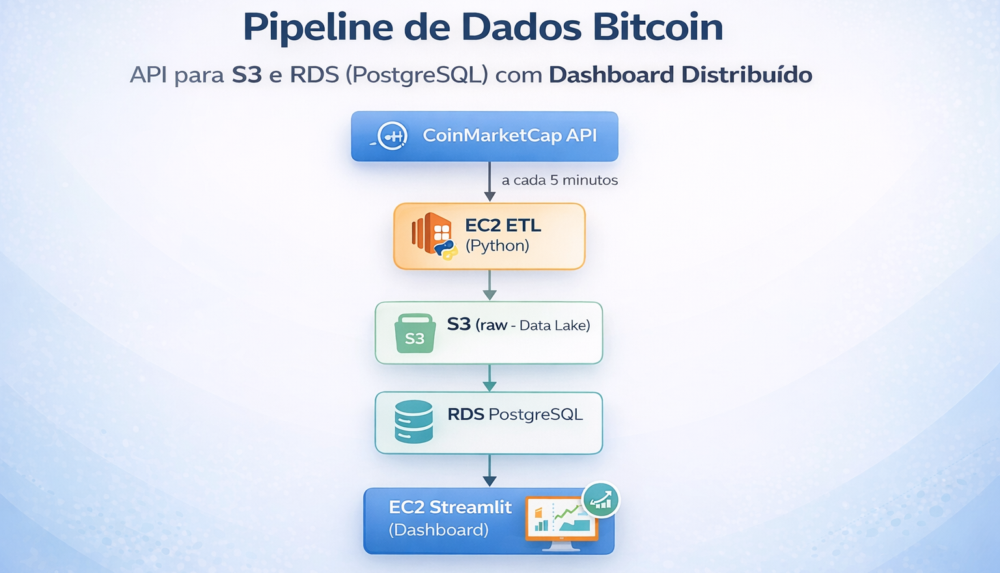
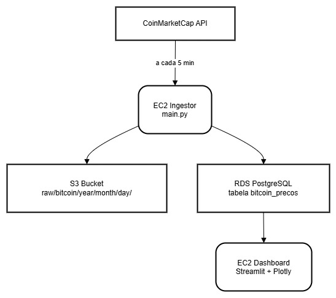
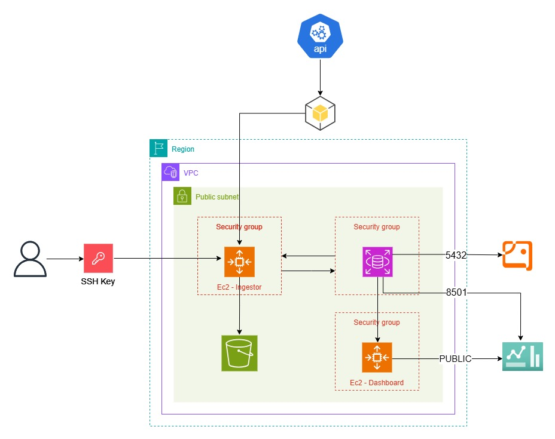
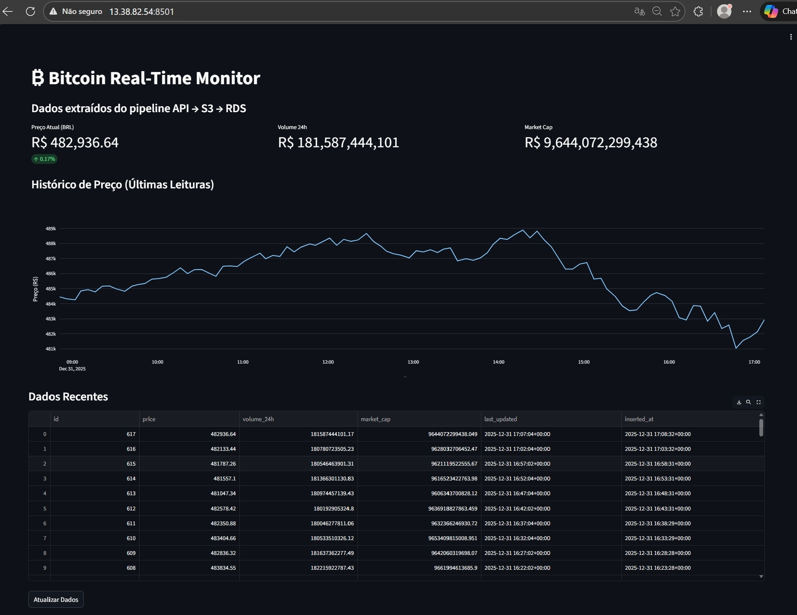
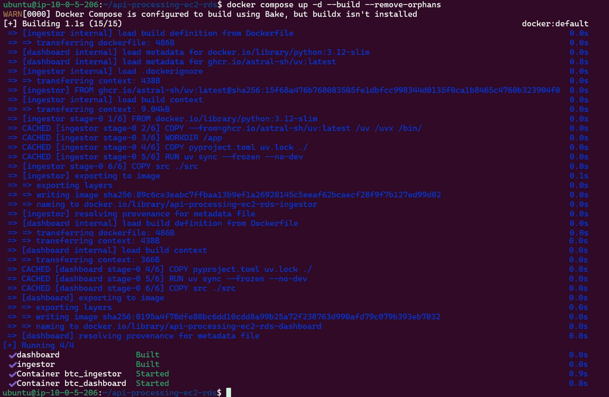
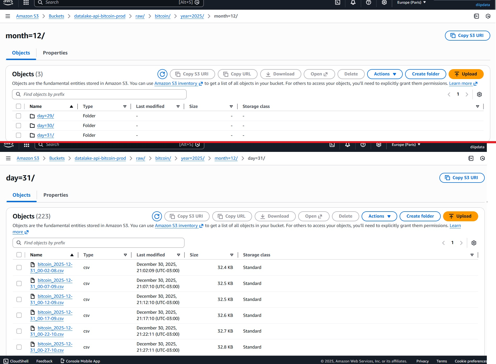
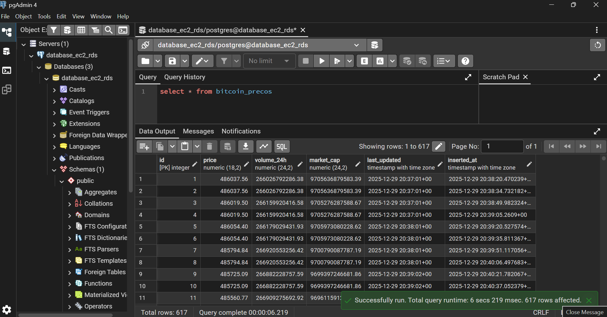

<p>

</p>

# Pipeline de Dados Bitcoin: API para S3 e RDS (PostgreSQL) com Dashboard Distribuído
[](https://www.python.org/)
[](https://www.docker.com/)
[](https://aws.amazon.com/)
[](https://aws.amazon.com/s3/)
[](https://www.postgresql.org/)
[](https://streamlit.io/)
[](https://plotly.com/)
[](https://github.com/astral-sh/uv)


Este projeto implementa um pipeline automatizado de ingestão de dados para monitoramento do preço do Bitcoin. A solução abrange desde a ingestão de APIs de terceiros passando por normalização, armazenamento em Data Lake (S3), persistência em banco de dados relacional (RDS) até a visualização em tempo real no Streamlit, utilizando uma arquitetura distribuída na AWS.

Todo ecossistema é containerizado com **Docker**, gerenciado pelo **uv** e orquestrado via **Docker Compose** em instâncias **AWS EC2** distintas, garantindo escalabilidade e isolamento.


### Dashboard ao vivo: http://13.38.82.54:8501/  
(Instância EC2 pública – porta 8501 liberada apenas para acesso externo controlado)

## Table of Contents

- [Arquitetura do Sistema](#arquitetura-do-sistema)
- [Por que essa arquitetura? (Decisões Técnicas)](#por-que-essa-arquitetura-decisões-técnicas)
- [Demonstração Visual](#demonstração-visual)
- [Estrutura do Projeto](#estrutura-do-projeto)
- [Stack Tecnológica](#stack-tecnológica)
- [Configuração e Deploy](#configuração-e-deploy)
- [Visualização e Dados](#visualização-e-dados)
- [Detalhes de Armazenamento](#detalhes-de-armazenamento)
- [Segurança e Boas Práticas](#segurança-e-boas-práticas)
- [Estimativa de Custos (AWS)](#estimativa-de-custos-aws)
- [Evolução do Projeto (Fases)](#evolução-do-projeto-fases)
- [Status do Projeto](#status-do-projeto)
- [Roadmap](#roadmap)
- [Recursos Adicionais](#recursos-adicionais)

## Arquitetura do Sistema

O projeto foi desenhado para separar as responsabilidades de escrita (Ingestão) e leitura (Dashboard), garantindo maior resiliência.

<p align="center">  </p>

Separação clara de responsabilidades:
- **EC2 Ingestor**: Coleta, normaliza e persiste dados.
- **EC2 Dashboard**: Apenas leitura do RDS para visualização.


## Por que essa arquitetura? (Decisões Técnicas)

- **Separação em duas EC2s**  
  Isolamento de escrita (ingestão 24/7) e leitura (dashboard).
  Evita que falhas no Streamlit (alto consumo de memória) impactem a coleta. Maior controle de portas e segurança.

  | EC2       | Função                  | Benefícios                          |
  |-----------|-------------------------|-------------------------------------|
  | EC2 #1    | ETL / Ingestão          | Execução contínua, scheduler simples|
  | EC2 #2    | Dashboard Streamlit     | Interface pública isolada           |
  | RDS       | Dados estruturados      | Consultas rápidas                   |
  | S3        | Histórico bruto (fonte da verdade) | Barato, escalável, auditoria      |

- **S3 como Data Lake (fonte da verdade)**  
  RDS é ótimo para consultas rápidas, mas caro e limitado para histórico infinito. S3 armazena CSV brutos particionados, permitindo reprocessamento, auditoria e integração futura com Athena/Glue.

  > "Por que salvar no S3 se já tem RDS?"  
  > - RDS: caro para grandes volumes  
  > - S3: barato (~$0.023/GB/mês), infinito e versionável

- **Docker + Compose**  
  Containerização garante reproducibilidade entre desenvolvimento e produção.

## Demonstração Visual

## Arquitetura AWS
  
*Diagrama com os serviços utilizados*

### Dashboard Streamlit em Tempo Real
  
*KPIs, gráfico de tendência e tabela de registros recentes.*

### Execução do Container (docker compose up)
  
*Terminal mostrando o build e execução do ingestor/dashboard.*

### Demo em Vídeo: Subindo o container e verificando ingestão
<video src="assets/demo-container.mp4" width="800" controls></video>
*Vídeo curto demonstrando o processo completo de deploy e salvamento de dados.*

### Armazenamento no S3 (Data Lake Particionado)
  
*Estrutura de pastas year/month/day pronta para Athena.*

### Tabela no RDS via pgAdmin
  
*Tabela bitcoin_precos populada com dados recentes.*


#### 1. **Ingestão (EC2 A)**: Script Python consome a API da CoinMarketCap a cada 5 minutos.

#### **Armazenamento Híbrido**:

- **Armazenamento Local**: Geração de CSV para auditoria/debug.

- **Data Lake (S3)**: Dados brutos salvos em CSV particionados por data `year/month/day` para futuras análises de Big Data (AWS Athena/PowerBI).

- **Data Warehouse (RDS)**: Dados estruturados em PostgreSQL para consultas de baixa latência.

## Estrutura do Projeto

```text
.
├── Dockerfile
├── docker-compose.yaml
├── pyproject.toml
├── uv.lock
├── README.md
├── docs/
│   ├── dashboard_details.md
│   ├── faq_tecnico.md
│   ├── infra_details.md
│   ├── ingestor_details.md
│   └── inventório_recursos_AWS.md
├── assets/                   # screenshots e vídeos
├── src/
│   ├── dashboard.py          # App Streamlit
│   ├── main.py               # Script de ingestão principal
│   └── dev/                  # Versões evolutivas (backups históricos)
│       ├── fetch1.py
│       ├── fetch2.py
│       ├── fetch3.py
│       └── fetch4.py
└── .env                      # Variáveis sensíveis (não versionado)
```

#### **Stack Tecnológica:**
* **Linguagem:** Python 3.12
* **Gestão de Dependências:** [uv](https://github.com/astral-sh/uv) (Performance)
* **Banco de Dados**: AWS RDS (PostgreSQL)
* **Object Storage**: AWS S3 (Data Lake)
* **Compute**: AWS EC2 (Ubuntu 24.04 LTS)
* **Containerização**: Docker & Docker Compose
* **Visualização**: Streamlit & Plotly

## Configuração e Deploy

#### 1. Quick Start (Teste Local)

```bash
git clone https://github.com/diipdata/api-processing-ec2-rds.git
cd api-processing-ec2-rds
```

#### 2. **Variáveis de Ambiente (.env)**

```bash
cp .env.example .env  # preencha com suas chaves
```

    # CoinMarketCap
    CMC_API_KEY=sua_chave_aqui

    # PostgreSQL (RDS)
    DB_HOST=seu-rds-endpoint.amazonaws.com
    DB_PORT=5432
    DB_NAME=bitcoin_db
    DB_USER=postgres
    DB_PASS=sua_senha

    # AWS Credentials
    AWS_ACCESS_KEY_ID=sua_access_key
    AWS_SECRET_ACCESS_KEY=sua_secret_key
    AWS_DEFAULT_REGION=us-east-1

  
#### 3. Deploy via Docker Compose

```bash
docker compose up --build
```

- Dashboard local: http://localhost:8501

  - [Detalhes técnicos do Ingestor](docs/ingestor_details.md)
  - [Detalhes técnicos do Dashboard](docs/dashboard_details.md)


## Visualização e Dados
**Dashboard em Tempo Real**

O dashboard pode ser acessado via navegador na porta 8501. Ele oferece:

- **KPIs**: Preço atual, Volume 24h e Market Cap.

- **Gráfico de Tendência**: Histórico de variação de preço.

- **Data Analysis**: Tabela detalhada dos últimos registros inseridos.

**Acesse aqui**: http://13.38.82.54:8501/

## Detalhes de Armazenamento

#### S3 (Data Lake)
- Os arquivos são organizados em partições para facilitar consultas via Athena ou processos de ETL futuros: 

  ```raw/bitcoin/year=YYYY/month=MM/day=DD/bitcoin_YYYY-MM-DD_HH-MM-SS.csv```

#### Modelagem do Banco (RDS)
- A tabela bitcoin_precos é estruturada para séries temporais:

  | Coluna | Tipo | Descrição |
  | :--- | :--- | :--- |
  | `price` | NUMERIC(18,2) | Preço em BRL |
  | `volume_24h` | NUMERIC(24,2) | Volume total negociado |
  | `market_cap` | NUMERIC(24,2) | Capitalização de mercado |
  | `last_updated` | TIMESTAMP | Horário oficial da cotação |
  | `inserted_at` | TIMESTAMP | Registro de entrada no banco |

## Inventório de recursos AWS

- [Clique aqui para ver alguns recursos da AWS que foram criados para essa aplicação](docs/inventório_recursos_AWS.md)


## Segurança e Boas Práticas
- **Security Groups**: A porta 5432 do RDS está aberta apenas para os IPs privados das instâncias EC2.

- **EC2 Dashboard (Acesso Externo)**: A porta 8501 do dashboard está protegida via regras de entrada no SG da AWS.

- **EC2 Ingestor**: sem porta pública (apenas outbound)

- **Identidade**: Ambas as instâncias utilizam o mesmo par de chaves SSH (.pem) para gerenciamento simplificado.

- **Credenciais**: nunca no código (usar .env + IAM roles quando possível)

- RDS em sub-rede privada (recomendado em prod)


## Estimativa de Custos (AWS) - Em Produção
Valores aproximados (us-east-1, Dez/2025, instâncias t3.micro, 24/7):

| Componente | Especificação | Custo Mensal Estimado | Observação |
| :--- | :--- | :--- | :--- |
| **S3 (Data Lake)** | Armazenamento | US$ 0,10 – 1,00 | Armazenamento bruto + requests |
| **RDS PostgreSQL** | db.t3.micro | US$ 18,00 – 22,00 | Principal custo fixo do projeto |
| **EC2 Ingestor** | t3.micro | US$ 8,00 – 10,00 | Instância On-Demand |
| **EC2 Dashboard** | t3.micro | US$ 8,00 – 10,00 | Opcional (pode desligar se não usar) |
| **Outros** | Transfer/Logs | US$ 1,00 – 3,00 | Data Transfer Out e CloudWatch |
| **Total Estimado** | --- | **US$ 35,10 – 46,00** | Valor total aproximado por mês |

- Total estimado: ~ US$ 35–45/mês
(Use Reserved Instances ou Savings Plans para reduzir ~30–70%)

## Evolução do Projeto (Fases)

1. **Fase 1**: CSV local + S3 + RDS (validação de permissões e fluxo)
2. **Fase 2**: S3 como fonte oficial (removido CSV local permanente)
3. **Fase 3**: Migração total para EC2 (execução 24/7 na nuvem)

## Status do Projeto
[x] Ingestão automática (API -> S3 + RDS).

[x] Arquitetura de containers com Docker.

[x] Deploy em múltiplas instâncias EC2.

[x] Dashboard Streamlit funcional.

- **Status**: Projeto em Produção e Funcional.

## Proximos passos (Roadmap)

[ ] Alertas de preço via Telegram

[ ] IaC com Terraform

[ ] Multi-AZ no RDS

[ ] Integração com Athena para análises avançadas


## Recursos Adicionais

- [FAQ Técnico e Aprendizados](docs/faq_tecnico.md)

- [Detalhes da Infra](docs/infra_detais.md)

 
---


**Criado por [Diego](https://github.com/diipdata)**  
diegop.freitas@gmail.com | [LinkedIn](https://linkedin.com/in/diegop-freitas) | [X/Twitter](https://x.com/diipdata)

Feito com ☕, persistência e muitos aprendizados na AWS.